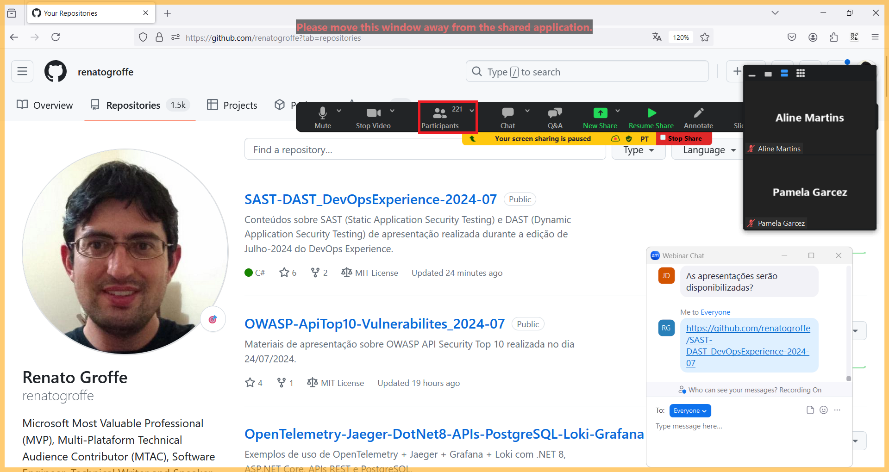

# SAST-DAST_DevOpsExperience-2024-07
Conteúdos sobre SAST (Static Application Security Testing) e DAST (Dynamic Application Security Testing) de apresentação realizada durante a edição de Julho-2024 do DevOps Experience.

Título da apresentação: **Detectando Vulnerabilidades em Aplicações: implementando testes SAST e DAST na prática!**

Data: **25/07/2024 (quinta-feira)**

Tipo do evento: **Online**

Ferramenta de transmissão: **Zoom**

Tecnologias e tópicos abordados: **Containers, Software Development, Cybersecurity, OWASP, Docker, Checkov, .NET, Python, Java, Node.js, Azure DevOps, Azure Pipelines, Azure Repos, Git, Linux, OWASP Dependency Check...**

Número de participantes: **221 pessoas (pico de audiência ao longo da live)**

Link do evento: [**Instagram**](https://www.instagram.com/p/C9lHyuKiFQR/)

Deixo aqui meus agradecimentos ao **Daniel Ginês** e à **Aline Martins** por todo o apoio para que eu partipasse como palestrante de mais uma edição do **DevOps Experience**.

---

Outros prints podem ser encontrados neste [**diretório**](/img/).